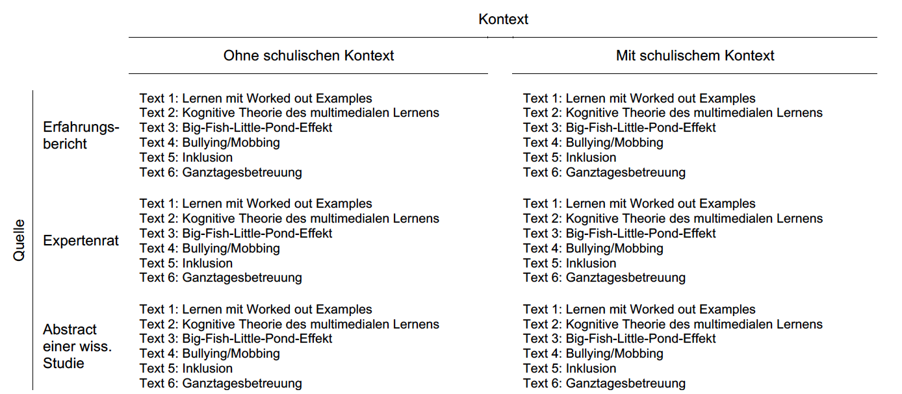

```{r setup, include=FALSE}
knitr::opts_chunk$set(echo = FALSE)
```

## Inhaltlicher und organisatorischer Überblick {.nullneunem}

* Einführung
* Epistemische Überzeugungen
    * Definitionen
    * Konzeptualisierungen
    * kritische Diskussion
* Synopse zentraler Befunde
    * Epistemische Überzeugungen sind **dualer Natur**
    * Epistemische Überzeugungen **kalibrieren die Lernstrategienwahl**
    * Epistemische Überzeugungen **sind funktional für das Interesse an/die Praxisrelevanzeinschätzung** von bildungswissenschaftlichem Wissen
* Ausblick

## Überblick anhand eines Beispiels {.flexbox .vcenter}
<div class="centered">
> _"Alle diese Sachen, die wir im BS machen, <span style="color:#A51E41">die gibt es ja nicht wirklich, die sind ja ausgedacht</span>, irgendwie so <span style="color:#A51E41">wischiwaschi</span> - und dann <span style="color:#B4A069">schreibt man eine Klausur dazu</span> - toll! <span style="color:#37414B">In Chemie ist das halt anders, bei den meisten Sachen</span> zumindest"_
</div>


# Epistemische Überzeugungen


## Zugänge zur Begrifflichkeit I
* **Ethymologie**
     * Episteme = Erkenntnis, Wissen, Wissenschaft
     * Logos = Wissenschaft, Lehre [@Meidl2009]
* **Konvention**
     * Epistemologie = Wissenschaftstheorie, -lehre; Erkenntnistheorie, -lehre [@duden]
* **Wörtliche Übersetzung**
     * epistemologische Überzeugung = Überzeugung die Wissenschaftstheorie betreffend
     * epistemische Überzeugungen = wissenschaftstheoretische Entitäten betreffende Überzeugung [@Kitchener2002]


     
## Zugänge zur Begrifflichkeit II
* **In Überblicksarbeiten**
     * Definition I: *[...] refers to what individuals think knowledge is and how they think that they and others know.* [@Hofer2012]
     * Definition II: *[...] refers to the theories or beliefs that students (and other individuals) hold about knowledge and the process of knowing.* [@Braten2010]  
* **Bibliographie**
     *   
* **Arbeitsdefinition:** Überzeugungen bzgl. der Natur und Genese von Wissen

## Überblick zentraler Konzeptualisierungen

<iframe src="https://prezi.com/embed/w0zgmp8dxqos/?bgcolor=ffffff&amp;lock_to_path=0&amp;autoplay=0&amp;autohide_ctrls=0&amp;landing_data=bHVZZmNaNDBIWnNjdEVENDRhZDFNZGNIUE43MHdLNWpsdFJLb2ZHanI0VnM5UWxrVXl0cVR5U3RpNWpTMnQvTjFRPT0&amp;landing_sign=hHmKC9yUL5vi_GEr6Cmct-iMGS5pEINiV7IMQFz5f0A" allowfullscreen="" mozallowfullscreen="" webkitallowfullscreen="" id="iframe_container" frameborder="0" height=200px width=355px></iframe>

## Konzeptuelle und methodologische Kritik {.nullachtem}

* Inhaltsvalidität [@Hartig2008]
     * **Dimensionale Konzeptualisierungen:** Definition der Dimensionen, **epistemischer** Charakter der Items [@Bromme2008; @Schommer1990; @Stahl2011]
     * **Positionale Konzeptualisierungen:** Sind Streitfragen/Interviewstimuli geeignet epistemische Überzeugungen *exklusiv, exhaustiv und in ausgewogenem Verhältnis* [@Hartig2008, S. 152] abzubilden?
     
* Konstruktvalidität [@Messick1995]
     * **Dimensionale Konzeptualisierungen:** 
          * Faktorenstruktur wird selten überprüft/entspricht selten den Annahmen [@Hofer1997; @Muis2006; @Priemer2006]
          * Interpretation der Faktoren als naiv--sophistiziert Kontinuum kann problematisch sein [@Elby2001; @Klopp2014; @Peter2015; @Stahl2011]
     * **Positionale Konzeptualisierungen:** 
          * Allg. Kritik an der Eindimensionalitätsannahme [@Hofer1997; @Limon2006; @Priemer2006]
          * Operationalsierung widerspricht in vielen Fällen der Eindimensionalitätsannahme [@Barzilai2015; @King1994; @Krettenauer2004; @Kuhn2000; @Peter2015]


# Duale Natur epistemischer Überzeugungen Lehramtsstudierender


## Duale Natur: Forschungsstand {.nullachtem}

* Dimensionale Konzeptualisierungen nahmen Eindimensionalität __und__ Domänengeneralität an [@Schommer1990].
* Epistemologische Unterschiede zwischen akademischen Domänen = Unterschiede in epistemischen Überzeugungen? [@Royce1980b; @Schmid2007a].
* Within- oder between-person Domänenspezifität [@Buehl2002; @Muis2006]?
* Ergebnisse einer einschlägigen Review von Muis, Bendixen, & Haerle [-@Muis2006]
     * |                      | within-design | between-design |
       |----------------------|---------------|----------------|
       | Domänen- Spezifität  | 4             | 8              |
       | Domänen- generalität | 1             | 0              |
       | Duale Natur          | 6             | 0              |
* Kritik: Theoretische Einbettung unklar; Untersuchungsdesigns teilw. inadäquat [@Limon2006; @Merk2016b; @Trautwein2004]


## Duale Natur: Rahmenmodell {.nullsiebenem}
<center></center>
<div class="centered">
Abb. 1: Theory of Integrated Domains in Epistemology. Abb. nach (Muis et al., 2006, S. 30).
</div>


## Duale Natur: Eigene Befunde
* Between-person Differenzen in epistemischen Überzeugungen zu bildungswissenschaftlichem Wissen sind sowohl aus dimensionaler [@Merk2016e], als auch aus positionaler [@Merk2016b; @Merk2016d] und personaler [@Merk2013] Perspektive marginal und lassen sich selten inferenzstatistisch absichern.
* Within-person Variation in epistemischen Überzeugungen ist sowohl über verschiedene Disziplinen [@Merk2016b] als auch innerhalb der Bildungswissenschaften [@Merk2016e; @Merk2016d] erheblich.
* Kontexte scheinen eine wesentlich geringere Rolle zu spielen als der Gegenstand selbst [@Merk2016d]


## Duale Natur: Interaktives Datenbeispiel {.nullachtem}
```{r import, echo=F}
library(feather)
rawdata_np <- read_feather("Daten/rawdata_np.feather")
rawdata_long_np <- read_feather("Daten/rawdata_long_np.feather")
```


### Design
- Experimentelle Faktoren
     * Within-Faktor: __Gegenstand__
     * Between-Faktor: __Quelle__
     * Between-Faktor: __Kontext__
     * 

### Material     
-  Umsetzung durch Textvignetten  


### Stichprobe

- `r nrow(rawdata_np)` Studierende nahmen freiwillig
     * im Rahmen einer obligatorischen Lehrveranstaltung
     * in Gruppensitzungen
     * unbezahlt teil
- `r round(100/nrow(rawdata_np)*sum(rawdata_np$sex==2, na.rm=T), digits = 1)`% waren weiblich und `r round(100/nrow(rawdata_np)*sum(rawdata_np$semester<4, na.rm=T), digits = 1)`% in den ersten drei Semestern
- Sitzung wurde von geschulten Testleitern anhand eines Manuals durchgeführt
- Das Projekt wurde im Rahmen der institutionellen Strategie der Universität Tübingen aus der Exzellenzinitiative gefördert (DFG ZUK 63)

### Skalen {.nullneunem}
- Within-Person
     * Überzeugung zur Theorie-Praxis Integration [@Kunter2014]
     * Cognitive Load [@Paas1992]
     * Theorienspezifischer Relativismus [@Merk2016c]
     * Interest-Enjoy [@McAuley1989]
- Between-Person
     * FREE [@Krettenauer2005]
     * FSI [@Krapp1993]
     * Treatmentcheck [@Merk2016c]
- Für alle Skalen ist die faktorielle Struktur (mit $\tau$-kongenerischen Messmodellen) bestätigt [@Merk2016c]
- Alle Skalen weisen befriedigende bis sehr gute Reliabilitätsschätzungen (McDonalds $\omega$) auf [@Merk2016c]


### Interaktive Übersicht
```{r shinydata, warning=F, message=F, cache=F, echo=F}
library(dplyr)
library(ggplot2)


rawdata_long_np <-  rawdata_long_np%>%
  mutate(STEM_Fächer = as.numeric(rowSums(data.frame(faecher_3, faecher_10, 
                                               faecher_13, faecher_17, faecher_18, faecher_20),  na.rm =T)),
         STEM_Fächer = as.factor(ifelse(STEM_Fächer == 0, "keins",
                                        ifelse(STEM_Fächer == 1, "genau 1",
                                               ifelse(STEM_Fächer >= 1, "min. 2", NA)))),
         STEM_Fächer = factor(STEM_Fächer, levels = c("keins","genau 1", "min. 2")),
         tr = rowMeans(select(., starts_with("tr_")), na.rm = T),
         im = rowMeans(select(., starts_with("im_")), na.rm = T),
         ie = rowMeans(select(., starts_with("ie_")), na.rm = T),
         tp = rowMeans(select(., starts_with("tp_")), na.rm = T),
         cl = rowMeans(select(., starts_with("cl_")), na.rm = T),
         cu = rowMeans(select(., starts_with("cu_")), na.rm = T),
         su = rowMeans(select(., starts_with("su_")), na.rm = T),
         ex = rowMeans(select(., starts_with("ex_")), na.rm = T),
         bo = rowMeans(select(., starts_with("bo_")), na.rm = T),
         di = rowMeans(select(., starts_with("di_")), na.rm = T),
         re = rowMeans(select(., starts_with("re_")), na.rm = T),
         te = rowMeans(select(., starts_with("te_")), na.rm = T)
         )


shiny_data <- rawdata_long_np %>% 
  select(topic, paradigm, source, context, tr, im, ie, tp, cl, cu, su, ex, bo, ke_01_np, sp_01_np, STEM_Fächer, di, te)%>%
  transmute(Text_Thema = as.factor(topic),
        
         Forschungsparadigma = as.factor(paradigm),
         Quelle_des_Wissens = as.factor(source),
         Schulkontext = as.factor(context),
         Relativismus =                scale(tr),
         Kenntnis =                    as.numeric(scale(ke_01_np)),
         Kohärenz =                    as.numeric(scale(sp_01_np)),
         Immersion =                   scale(im),
         Interesse_Enjoyment =         scale(ie),
         Theorie_Praxis_Integration =  scale(tp),
         Cognitive_Load =              scale(cl),
         Neugier =                     scale(cu),
         Ueberraschung =               scale(su),
         Spannung =                    scale(ex),
         Langeweile =                  scale(bo),
         D_Index =                     scale(di),
         Texture =                     scale(te),
         Anzahl_STEM = STEM_Fächer)

library(car)

shiny_data$Text_Thema <- recode(shiny_data$Text_Thema, 
                               "'bp' = 'Big Fish Little Pond';
                                'we' = 'Bsp. basiertes Lernen';
                                'cm' = 'Multimediales Lernen';
                                'bm' = 'Mobbing';
                                'gt' = 'Ganztagesbetreuung';
                                'in' = 'Inklusion'")

shiny_data$Forschungsparadigma <- recode(shiny_data$Forschungsparadigma, 
                                "'dd' = 'Didaktisches Design';
                                'ed' = 'Empirisch deskriptiv';
                                'gr' = 'Geisteswissenshaftlich rational'")

shiny_data$Text_Thema <- factor(shiny_data$Text_Thema, levels = c('Bsp. basiertes Lernen',
                                                                  'Multimediales Lernen',
                                                                  'Big Fish Little Pond',
                                                                  'Mobbing',
                                                                  'Ganztagesbetreuung',
                                                                  'Inklusion'))

library(shinythemes)
  fluidPage(theme = shinytheme("flatly"),
    sidebarLayout(
      
      sidebarPanel(width=3,
           checkboxInput('jitter', 'Jitter'),
           checkboxInput('meanci', 'MW & CI', value = F),
           checkboxInput('violin', 'Dichte', value = T),
           checkboxInput('smoother', 'Smoother', value = F),
           selectInput('x', 'X', names(shiny_data), selected = "Text_Thema"),
           selectInput('y', 'Y', names(shiny_data), selected = "Relativismus"),
           selectInput('color', 'Color', c('None', names(shiny_data))),
           selectInput('size', 'Size', c('None', names(shiny_data))),
           selectInput('facet_row', 'Facetten',
                       c(None='.', names(shiny_data[sapply(shiny_data, is.factor)])))
      ),
      
      mainPanel(width = 9, plotOutput('plot', height = "650px"))
    )
  
)

dataset <- reactive({
    shiny_data
  })
  
  output$plot <- renderPlot({
    
  
    
        p <- ggplot(dataset(), aes_string(x=input$x, y=input$y)) +   theme(axis.title.y = element_text(size = 16, face = "bold"), axis.text.y = element_text(size = 14, face = "bold"),axis.title.x = element_text(size = 16, face = "bold"),axis.text.x = element_text(size = 12, face = "bold", angle = 40, hjust = 1, vjust = 1), legend.position="top") 
    
        
         if (input$size != 'None')
        p <- ggplot(dataset(), aes_string(x=input$x, y=input$y, size = input$size))  + theme(axis.title.y = element_text(size = 16, face = "bold"), axis.text.y = element_text(size = 14, face = "bold"),axis.title.x = element_text(size = 16, face = "bold"),axis.text.x = element_text(size = 12, face = "bold", angle = 40, hjust = 1, vjust = 1), legend.position="top")
        
        
      if (input$violin)
    p <- p + geom_violin(adjust = 1, alpha = 1/3, colour = "#A51E41", fill = "#FFBCB5")
      
     
      
    if (input$color != 'None')
      p <- p + aes_string(color=input$color) + scale_colour_gradient(low="yellow")
    
    facets <- paste(input$facet_row, '~', '.')
    if (facets != '. ~ .')
      p <- p + facet_grid(facets)
    
    if (input$jitter & input$size == "None")
      p <- p + geom_jitter(alpha=0.3, size = 3.1) + scale_colour_gradient(low="#A51E41", high="#2B99FF")
    
        if (input$jitter & input$size != "None")
      p <- p + geom_jitter(alpha=0.3) + scale_colour_gradient(low="#A51E41", high="#2B99FF")
    
    if (input$smoother)
      p <- p + stat_smooth(method = "lm")
    
    if (input$meanci)
      p <- p + stat_summary(fun.data = "mean_cl_boot", colour = "red", size=0.45) 
    
    p + coord_cartesian(ylim = c(-3, 3))

    
  }, width = 650)


```

### Ergebnisse aus Mehrebenenstrukturgleichungsmodellierung

<div class="centered" ><font size="-1">
Pfaddiagramm eines MLSEM ($\chi^2$ = 234.789, df = 134, RMSEA = 0.020, CFI = 0.938, TLI = 0.925 SRMR.Within = 0.028, SRMR.Between = 0.064). Die Residualkovarianz $Cov(gr_{1ij}^{b}, gr_{3ij}^{b})$ sowie das Messmodell des D-Indexes (= di) sind nicht dargestellt.
tr = TR = theorienspezifischer Relativismus; CM = Cognitive Theory of Multimedia Learning; BF = Big Fish Little Pond Effect; BM = Bullying Mobbing; IN = Inklusion; GT = Ganztagesschule.
Alle Strukturmodellpfade sind bei p = .01 signifikant.
</font></div>


## Duale Natur: Modellierung {.nullsechsem}
<center></center>

Abb. 2: Pfaddiagramm eines MLSEM ($\chi^2$ = 234.789, df = 134, RMSEA = 0.020, CFI = 0.938, TLI = 0.925 SRMR.Within = 0.028, SRMR.Between = 0.064). Die Residualkovarianz $Cov(gr_{1ij}^{b}, gr_{3ij}^{b})$ sowie das Messmodell des D-Indexes (= di) sind nicht dargestellt.
tr = TR = theorienspezifischer Relativismus; CM = Cognitive Theory of Multimedia Learning; BF = Big Fish Little Pond Effect; BM = Bullying Mobbing; IN = Inklusion; GT = Ganztagesschule.
Alle Strukturmodellpfade sind bei p = .01 signifikant.


# Die Kalibrierungshypothese


## Kalibrierungshypothese: Rahmenmodell {.nullsiebenem}
<center></center>
<div class="centered">
Abb. 3: Das COPES-Modell selbstregulierten Lernens. Abb. nach [@Winne1998]
</div>

## Die Kalibrierungshypothese I
* Erweiterung des klassischen Kalibrierungsbegriffs [@Alexander2013; @Nelson1991] durch Stephanie Pieschl [@Pieschl2009] auf die Passung internaler Lernprozesse und allgemeiner externaler Bedingungen  

<center> 
<div class="centered" ><font size="-1">
Abb. 4: Erweiterte Definition des Kalibrierungsbegriffs nach [@Pieschl2009]. Abbildung (ebd. S. 16).
</font></div>


## Die Kalibrierungshypothese II
* Bromme et al. [-@Bromme2010] beschreiben kalibrierende Wirkung epistemsicher Überzeugungen im Kontext selbstregulierten Lernens als "Linsenfunktion".
<center></center>
<div class="centered" ><font size="-1">
Abb. 5: Erweiterte Kalibrierung als Linsenfunktion nach [@Pieschl2009]. Eigene Darstellung.
</font></div>


## Kalibrierungshypothese: Eigener Befund {.nullachtem}
* Stichprobe: _N_ = 805 Lehramtsstudierende im Grundstudium
* Material: 
     * Drei Aufgaben unterschiedlicher Komplexität (revidiert) nach Bloom [@Anderson2001].
     * COPES-Questionaire [@Pieschl2008c].
     * CAEB [@Stahl2006].
* Modellierung: Random-Intercept HLM mit Level-1 Dummyvariablen für Komplexitätsniveaus, Level-2 Prädiktor "Texture" und Cross-Level Interaktionstermen.     
* Ergebnisse:
<center></center>


## Epistemische Überzeugungen und Professionalität I
* Explizitem Bezug der Forschung zu epistemischen Überzeugungen auf die Professionalisierungsforschung wird vielfach hohes Potential zugemessen [@Baumert2006; @Bromme1992; @Hofer2010; @Hofer2010; @Muis2004; @Tsai2007; @Olafson2010].
* "Personal Epistemology in Teacher Education" wird von manchen Autorinnen als "emerging field" gesehen [@Brownlee2015].
* Hauptsächlich bearbeitet werden:
     * Rolle epistemischer Überzeugungen im Überzeugungssystem (insb. Verhältnis zu Lehr- Lerntheoretischen Überzeugungen) [vgl. @Lee2011]
     * Kohärenz zu unterrichtlichem Handeln (meist auf Sichtstrukturebene) [vgl. @Schwartz2011]
* Sehr große konzeptuelle und methodologische Heterogenität 


## Epistemische Überzeugungen und Professionalität II {.nullachtem}
### Verhältnisbestimmung innerhalb des deutschsprachigen Diskurses
* Kompetenztheoretischer Ansatz
     * eÜ sind generischer Bestandteil
     * Funktionalität im Sinne fachdidaktischer Konzeptualisierungen
     * __Filter, Framing__ und __Guiding__ Funktionalität [@Fives2012] auch innerhalb der Kompetenzaspekte/-bereiche 
* Strukturtheoretischer Ansatz
     * Bezug weit weniger explizit
     * Jedoch Anschlussfähigkeit an Schöns [-@Schon1983] Unterscheidungen von "knowing in action", "reflecting in action" und "reflecting on action" [@Kolbe2005]
* Berufsbiographischer Ansatz
     * Intraindividueller Fokus auf den Aufbau eines "beruflichen Selbsts" [@Bauer2000b]
     * Dieses enthält explizit die Orientierung des Habitus an Berufswissenschaften
     
> __$\Rightarrow$ Epistemische Überzeugungen sind _funktional_ für die Entwicklung von Professionalität von Lehrerinnen und Lehrern__


## Epistemische Überzeugungen und Professionalität: Eigene Befunde
* Epistemische Überzeugungen prädizieren die Bedeutsamkeitseinschätzungen von pädagogischem und fachidaktischem Wissen für den (KMK-)Kompetenzerwerb bei Referendarinnen und Referendaren [@Merk2016a].
* Epistemische Überzeugungen prädizieren die Praxisrelevanz bildungswissenschaftlicher Befunde nach Kontrolle motivationaler und affektiver Variablen [@Merk2016g]

## Epistemische Überzeugungen und Professionalität: Interaktives Datenbeispiel
### Interaktives Beispiel
```{r shinyapp2, message=F, warning=F, echo=FALSE, eval=T}
library(shinythemes)
  fluidPage(theme = shinytheme("flatly"),
    sidebarLayout(
      
      sidebarPanel(width=3,
           checkboxInput('jitter2', 'Jitter'),
           checkboxInput('meanci2', 'MW & CI', value = F),
           checkboxInput('violin2', 'Dichte', value = T),
           checkboxInput('smoother2', 'Smoother', value = F),
           selectInput('x2', 'X', names(shiny_data), selected = "Text_Thema"),
           selectInput('y2', 'Y', names(shiny_data), selected = "Relativismus"),
           selectInput('color2', 'Color', c('None', names(shiny_data))),
           selectInput('size2', 'Size', c('None', names(shiny_data))),
           selectInput('facet_row2', 'Facetten',
                       c(None='.', names(shiny_data[sapply(shiny_data, is.factor)])))
      ),
      
      mainPanel(width = 9, plotOutput('plot2', height = "650px"))
    )
  
)

dataset2 <- reactive({
    shiny_data
  })
  
  output$plot2 <- renderPlot({
    
  
    
        p2 <- ggplot(dataset2(), aes_string(x=input$x2, y=input$y2)) +   theme(axis.title.y = element_text(size = 16, face = "bold"), axis.text.y = element_text(size = 14, face = "bold"),axis.title.x = element_text(size = 16, face = "bold"),axis.text.x = element_text(size = 12, face = "bold", angle = 40, hjust = 1, vjust = 1), legend.position="top") 
    
        
         if (input$size2 != 'None')
        p2 <- ggplot(dataset2(), aes_string(x=input$x2, y=input$y2, size = input$size2))  + theme(axis.title.y = element_text(size = 16, face = "bold"), axis.text.y = element_text(size = 14, face = "bold"),axis.title.x = element_text(size = 16, face = "bold"),axis.text.x = element_text(size = 12, face = "bold", angle = 40, hjust = 1, vjust = 1), legend.position="top")
        
        
      if (input$violin2)
    p2 <- p2 + geom_violin(adjust = 1, alpha = 1/3, colour = "#A51E41", fill = "#FFBCB5")
      
     
      
    if (input$color2 != 'None')
      p2 <- p2 + aes_string(color=input$color2) + scale_colour_gradient(low="yellow")
    
    facets2 <- paste(input$facet_row2, '~', '.')
    if (facets2 != '. ~ .')
      p2 <- p2 + facet_grid(facets2)
    
    if (input$jitter2 & input$size2 == "None")
      p2 <- p2 + geom_jitter(alpha=0.3, size = 3.1) + scale_colour_gradient(low="#A51E41", high="#2B99FF")
    
        if (input$jitter2 & input$size2 != "None")
      p2 <- p2 + geom_jitter(alpha=0.3) + scale_colour_gradient(low="#A51E41", high="#2B99FF")
    
    if (input$smoother2)
      p2 <- p2 + stat_smooth(method = "lm")
    
    if (input$meanci2)
      p2 <- p2 + stat_summary(fun.data = "mean_cl_boot", colour = "red", size=0.45) 
    
    p2 + coord_cartesian(ylim = c(-3, 3))

    
  }, width = 650)


```

### Modellierung
## Ergebnisse aus Mehrebenenstrukturgleichungsmodellierung

<div class="centered" ><font size="-1">
Pfaddiagramm eines MLSEM ($\chi^2$ = 234.789, df = 134, RMSEA = 0.020, CFI = 0.938, TLI = 0.925 SRMR.Within = 0.028, SRMR.Between = 0.064). Die Residualkovarianz $Cov(gr_{1ij}^{b}, gr_{3ij}^{b})$ sowie das Messmodell des D-Indexes (= di) sind nicht dargestellt.
tr = TR = theorienspezifischer Relativismus; CM = Cognitive Theory of Multimedia Learning; BF = Big Fish Little Pond Effect; BM = Bullying Mobbing; IN = Inklusion; GT = Ganztagesschule.
Alle Strukturmodellpfade sind bei p = .01 signifikant.
</font></div>

## Literatur {.nullvierem}
<style>
slides > slide { overflow: scroll; }
</style>